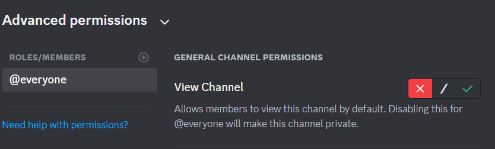
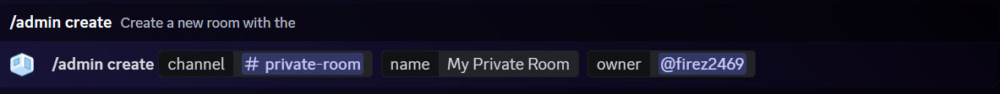
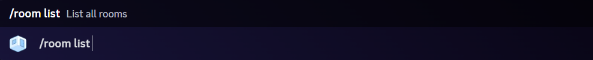

# RoomBa Discord Bot

## Instructions

### Getting Started
As admin create a new private channel. Call it the room name. Say: `private-room`. Make sure this room is private and cannot be viewed by your default users.

Once set up run:

If you now run:

### Admin
If you have admin permissions on the discord server you may run these commands.

#### Creating Rooms

    /admin create [discord channel] [room name] [discord user owner]

- `[discord channel]` is the discord channel on the discord server this room is associated with. 
- `[room name]` is the name you wish to give the room, that people can lookup.
- `[discord user owner]` the discord user you want to assign as the owner of this room.

#### Deleting Rooms

    /admin delete [discord channel]

- `[discord channel]` is the discord channel you want rooms removed from.

#### Changing Ownership

    /admin change_owner [discord channel] [new discord user]

- `[discord channel]` is the discord channel you are reassigning ownership.
- `[new discord user]` is the new discord user you want to assign as owner.

This command will disable ownership of the previous owner automatically but they will remain in the room unless they have left previously.

### User Commands
#### Listing All Rooms

    /room list

Lists out all rooms, their owners and their respective channels.

#### Joining A Room

    /room join [name]

Sends a request to the room owner to allow you into their room.

#### Leaving A Room

    /room leave [name]

Makes you leave a room so they can no longer view it.

#### Kicking a Person From A Room

    /room kick [room name] [user]

Kicks a person from a room so they can no longer view it.

#### Sliding through the House

    /room slide

Slides a person through a series of rooms sending a message and deleting it right after.

**Note:** This command can only be run from the top of the slide.
